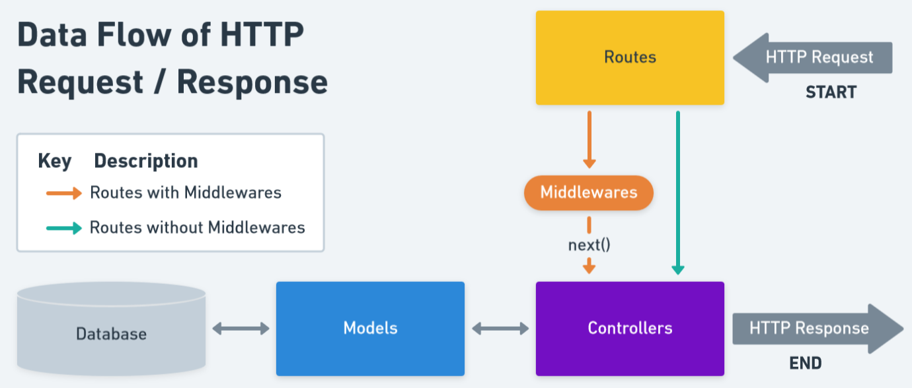
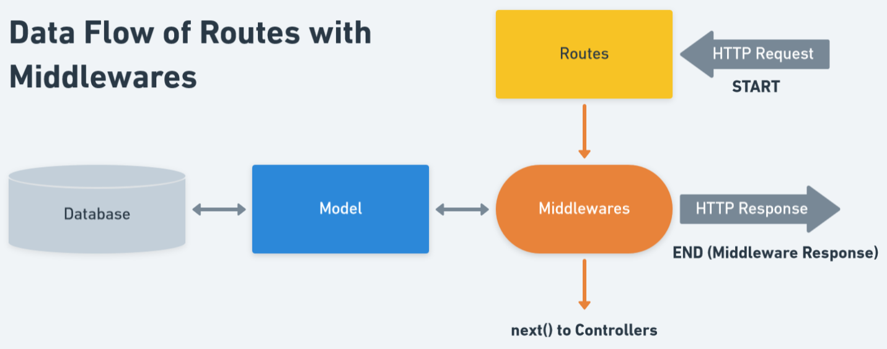
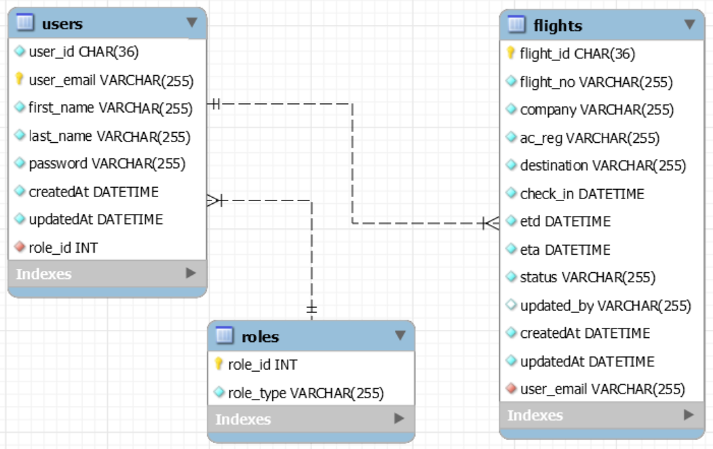

# Flight Movement App (Back-end)

The is the REST API server for the Flight Movement App. To access the Front-end, please [**click here**](https://github.com/devchia254/flight-movement-app-v1)

## Info

- This REST API was built using Node.js and Express.js.
- The database model was developed using MySQL.
- The server is hosted on Heroku (Free and Hobby Plan) using the ClearDB add-on.

## Purpose

- To familiarise with CRUD operations in a REST API.
- To cement my knowledge on Back-end with Node.js and Express.js.
- To learn ORM practices and how it interacts with an SQL database.

## Features

- Security features: JWT authentication & authorisation and hashed passwords with bcrypt
- Used Sequelize to interact with the MySQL database

## Project Structure

### Data Flow of HTTP Request / Response


The above diagram gives a general idea on how this REST API handles HTTP Requests and Responses. It highlights the data flow for **two types** of routes which are routes that require middlewares and routes that don't.

#### Controllers & Routes

Based on the file names, both controllers and routes that share the same first name interact with each other.

Each of their purpose is described below:

- auth - Handles the logging in (JWT authentication) and registration (Brcypt) of the users.
- public - Handles the fetching of flights for the homepage only.
- user - Handles all the user priveleges i.e. CRUD operations, for scheduling a flight.
- admin - Strictly for admin and handles the user management of the app.

### Data Flow of Routes with Middleware



This diagram can be seen as extension for the first diagram where it reveals the data flow for the routes with middlewares.

Certain routes would have to go through middlewares first before proceeding to the controllers, but those that fail to fulfill the middleware conditions would instead send an HTTP response to the client regarding it.

The middlewares implemented are:

- authJwt - This handles the JWT authorisation but also verifies whether the request was from a user or admin.
- verifySignUp - This is just a check for any duplicate emails when registering a user.

### Database Model Design



## Yarn Dev Packages

A brief description of the packages used below:

- `body-parser` - middleware for parsing request bodies.
- `cors` - middleware for enabling CORS.
- `moment` uses Moment.js as a date management library.
- `sequelize` - The ORM used for communicating with MySQL database.
- `mysql2` - A MySQL client for Node.js.
- `jsonwebtoken` - JWT Authentication & Authorisation.
- `bcryptjs` - A Hashing password function.
- `namor` - A random name generator.
- `nodemon` - A development tool for Node.js.

```json
"dependencies": {
    "bcryptjs": "^2.4.3",
    "body-parser": "^1.19.0",
    "cors": "^2.8.5",
    "express": "^4.17.1",
    "jsonwebtoken": "^8.5.1",
    "moment": "^2.28.0",
    "mysql2": "^2.1.0",
    "namor": "^2.0.2",
    "nodemon": "^2.0.5",
    "sequelize": "^6.3.5"
}
```
